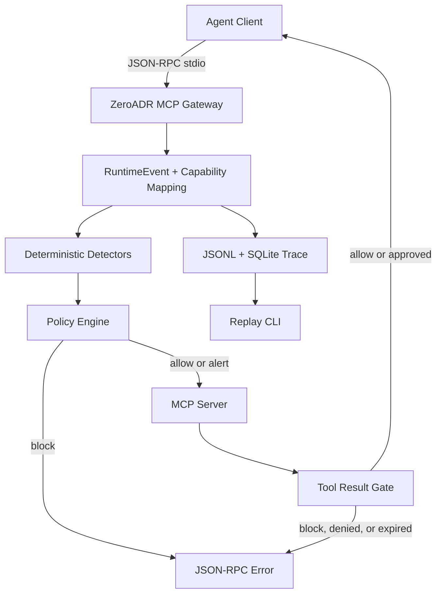

# ZeroADR Architecture

ZeroADR is an Agent Runtime Security Platform with request-time and MCP
result-time controls:

```text
MCP stdio proxy -> RuntimeEvent -> Capability Mapping -> Detection -> Policy -> Result Gate -> Trace/Replay
```

## Runtime Flow



## Planes

- Collection Plane: MCP stdio proxy, hooks, replay, and Endpoint sensors.
- Normalization Plane: `RuntimeEvent` and capability mapping.
- Trace Plane: `SessionTrace`, findings, and policy decisions.
- Detection Plane: deterministic rule and sequence detectors.
- Control Plane: `allow`, `alert`, `block`, approval, and MCP Tool Result Gate.
- Operations Plane: CLI, API, Console, reconstruction, evidence, and replay.

## Current Boundaries

The gateway handles inline decisions before `tools/call` reaches the MCP server
and can hold successful responses for rules or bounded Hybrid review. Hook
post-tool, Endpoint, and Replay remain observational.
