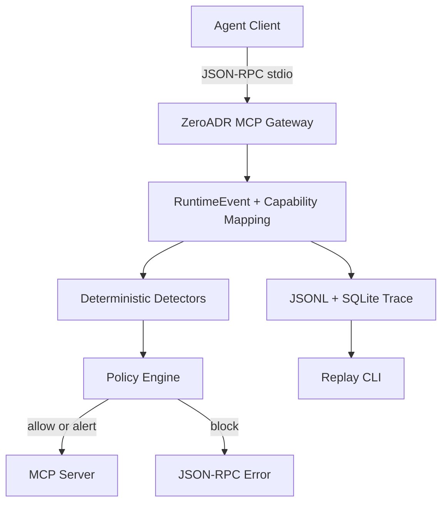

# ZeroADR Architecture

ZeroADR is an Agent Runtime Security Platform. The current implementation is the
MCP-first v0.1 loop:

```text
MCP stdio proxy -> RuntimeEvent -> Capability Mapping -> Detection -> Policy -> Trace -> Replay
```

## Runtime Flow



## Planes

- Collection Plane: MCP stdio proxy today; hooks, adapters, and sensors later.
- Normalization Plane: `RuntimeEvent` and capability mapping.
- Trace Plane: `SessionTrace`, findings, and policy decisions.
- Detection Plane: deterministic rule and sequence detectors.
- Control Plane: `allow`, `alert`, and `block` in v0.1.
- Operations Plane: CLI inspect, export, and replay today; console later.

## Current Boundaries

The v0.1 gateway is local-first and does not call remote services. It handles
inline decisions before `tools/call` reaches the MCP server, while replay handles
session-level chain detection over saved traces.
